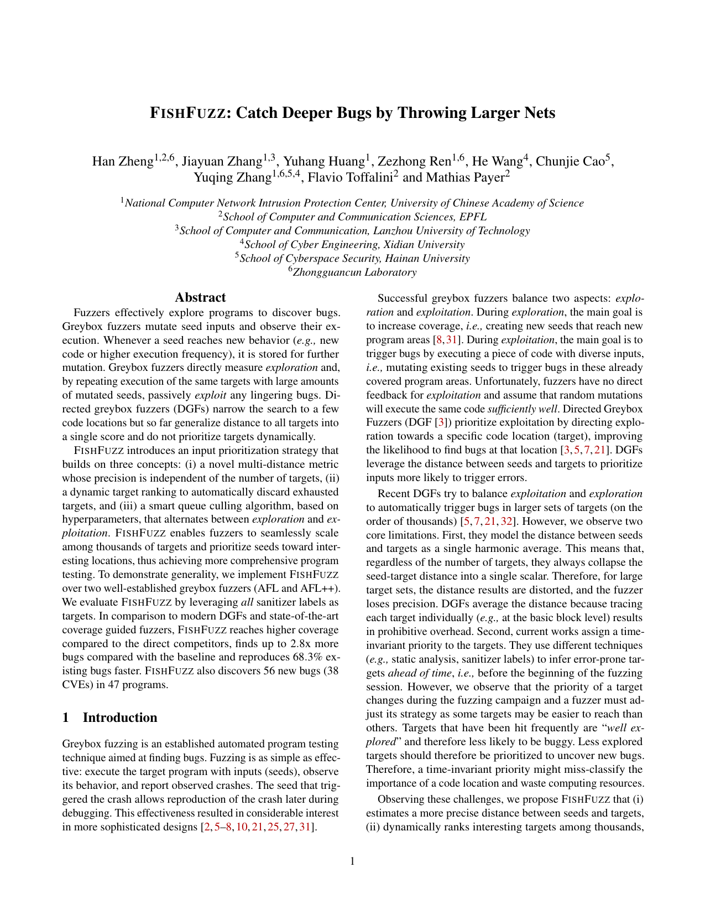

## FishFuzz: Catch Deeper Bugs by Throwing Larger Nets

<a href="https://hexhive.epfl.ch/publications/files/23SEC5.pdf" target="_blank"></a>

FishFuzz is an input prioritization strategy that efficiently direct fuzzing towards the promising sanitizer targets. We implement the FishFuzz prototype based on [AFL](https://github.com/google/afl) and [AFL++](https://github.com/AFLplusplus/AFLplusplus/).

For more details, check out our [paper](https://www.usenix.org/system/files/usenixsecurity23-zheng.pdf). To cite our work, you can use the following BibTeX entry:

```bibtex
@inproceedings{zheng2023fishfuzz,
  title={FISHFUZZ: Catch Deeper Bugs by Throwing Larger Nets},
  author={Zheng, Han and Zhang, Jiayuan and Huang, Yuhang and Ren, Zezhong and Wang, He and Cao, Chunjie and Zhang, Yuqing and Toffalini, Flavio and Payer, Mathias},
  booktitle={32nd USENIX Security Symposium (USENIX Security 23)},
  pages={1343--1360},
  year={2023},
  organization={USENIX Association}
}
```

## Published Work

FishFuzz is accepted in USENIX Security Symposium 2023 and will occur with the paper accepted in Winter cycle.

TuneFuzz is accepted in SBFT24@Fuzzing Workshop and rank 2nd place in final competition.

## SBFT24

To address the compatibility issues with FuzzBench, we implement a new extension TuneFuzz based on FF_AFL++.
We submit TuneFuzz to SBFT24@Fuzzing competition and won 2nd place. The source is available at tunefuzz_sbft24 branch,
and the configuration can be found at https://github.com/HexHive/fuzzbench-TuneFuzz.

## Repo Structure
```
FishFuzz/
├── FF_AFL                      # FishFuzz version AFL
│   ├── ....
│   ├── docker                  # dockerfile to build FF_AFL++
│   ├── afl-fuzz.c              # modified input prioritization algorithm
│   ├── dyncfg                  # static cfg/cg distance & runtime distance module
│   ├── llvm_mode               # modified pass and wrapper
│   └──scripts                  # distance calculation script
├── FF_AFL++                    # FishFuzz version AFL++
│   ├── ....
│   ├── docker                  # dockerfile to build FF_AFL++
│   ├── dyncfg                  # static cfg/cg distance
│   ├── instrumentation         # modified pass and wrapper
│   ├── scripts                 # distance calculation script
│   ├── src
│   │   ├── ...
│   │   ├── afl-fishfuzz.cc     # dynamic distance && dynamic target  
│   │   ├── afl-fuzz-debug.c    # debug log
│   │   └── afl-fuzz-queue.c    # alter between 3 stages
├── README.md
└── paper
    ├── README.md               
    ├── artifact                # for artifact evaluation
    ├── fuzzbench               # intergration with fuzzbench (WIP, not ready yet)
    ├── hyperparam              # supportive materials for paper
    ├── p-value
    └── vuln
```

## Reproduce The Results In The Paper

We attach the raw data of the evaluation in `paper` folder as promised, and we'll dockerize some of the evaluation process to allow the researchers to easily reproduce our evaluation results. Please follow the guide in `paper/artifact/README.md`. The bug triaging script only do simple deduplication 
based on call stack, and might require more manual efforts.

## How To Build FishFuzz

We provide a dockerfile for both FF_AFL and FF_AFL++, which can be found in `FF_AFL(++)/docker/Dockerfile`

## How To Compile & Run

The simplest way is using the wrapper `ff-all-in-one`, point `CC/CXX` to `ff-all-in-one/++`, set CFLAGS with ASan or UBSan, then set `FF_DRIVER_NAME` with the programs you want to fuzz (e.g. for libxml2, we want to fuzz xmllint and you should set `FF_DRIVER_NAME` as xmllint but not libxml2 ) then just follow the origin process.

The `ff-all-in-one` can be roughly devided into several steps:
  1) compile the programs with lto mode (and generated temporary bitcode file)
  2) run the pass with `conly` option on this bitcode, which instrument the bitcode with coverage
  3) run the pass with `aonly` option, which will output temporary file in TEMP_DIR and modify the basic block name
  4) calculate the distance for both cfg and cg
  5) instrument the function and sanitizer location based on log file produced in step 3), generate the binary to fuzz


run the `afl-fuzz` with additional environment variable `TMP_DIR` (generated in step 3)), which provide static distance map and sanitized function list.

### Examples For Wrapper Usage

```
mkdir -p /benchmark/source/ && cd /benchmark/source/
wget https://mujs.com/downloads/mujs-1.0.2.tar.gz && tar xzf mujs-1.0.2.tar.gz -C /benchmark

export FF_DRIVER_NAME=mujs
export CC="/FishFuzz/ff-all-in-one -fsanitize=address"
export CXX="/FishFuzz/ff-all-in-one++ -fsanitize=address"
# mujs didn't import CFLAGS from environment, for other programs you could set CFLAGS/CC respectively
# export CFLAGS="-fsanitize=address"
# export CXXFLAGS="-fsanitize=address"

cd /benchmark/mujs-1.0.2 && make -j$(nproc)

# ff-all-in-one will produce xx.fuzz and TEMP_$FF_DRIVER_NAME, pick them for fuzzing
TMP_DIR=TEMP_mujs $PREFUZZ/afl-fuzz -i /path/to/in -o /path/to/out -m none -t 1000+ -- build/release/mujs.fuzz @@

```


### Examples For Manual Compilation

**Note: for FF_AFL++, the steps are bit different, please refer to the demo in `paper/artifact/two-stage/build/cflow.sh`**

```
cd /benchmark/source/
wget https://mujs.com/downloads/mujs-1.0.2.tar.gz && tar xzf mujs-1.0.2.tar.gz -C /benchmark


export FF_DRIVER_NAME=mujs
export SRC_DIR=/benchmark/mujs-1.0.2
export FUZZER=FishFuzz
export FUZZ_DIR=/fuzz/$FF_DRIVER_NAME/$FUZZER/$FF_DRIVER_NAME


# step 1, generating .bc file, you can use wllvm or similar approach as you wish
export CC="clang -fsanitize=address -flto -fuse-ld=gold -Wl,-plugin-opt=save-temps -Wno-unused-command-line-argument"
export CXX="clang++ -fsanitize=address -flto -fuse-ld=gold -Wl,-plugin-opt=save-temps -Wno-unused-command-line-argument"
cd $SRC_DIR && make -j$(nproc)

# step 2, coverage instrumentation and analysis
export PREFUZZ=/FishFuzz/
export TMP_DIR=$PWD/TEMP
export ADDITIONAL_COV="-load $PREFUZZ/afl-llvm-pass.so -test -outdir=$TMP_DIR -pmode=conly"
export ADDITIONAL_ANALYSIS="-load $PREFUZZ/afl-llvm-pass.so -test -outdir=$TMP_DIR -pmode=aonly"
export BC_PATH=$(find . -name "$FF_DRIVER_NAME.0.5.precodegen.bc" -printf "%h\n")/
mkdir -p $TMP_DIR
opt $ADDITIONAL_COV $BC_PATH$FF_DRIVER_NAME.0.5.precodegen.bc -o $BC_PATH$FF_DRIVER_NAME.final.bc 
opt $ADDITIONAL_ANALYSIS $BC_PATH$FF_DRIVER_NAME.final.bc -o $BC_PATH$FF_DRIVER_NAME.temp.bc

# step 3, static distance map calculation
opt -dot-callgraph $BC_PATH$FF_DRIVER_NAME.0.5.precodegen.bc && mv $BC_PATH$FF_DRIVER_NAME.0.5.precodegen.bc.callgraph.dot $TMP_DIR/dot-files/callgraph.dot
$PREFUZZ/scripts/gen_initial_distance.py $TMP_DIR

# step 4, generating final target
export ADDITIONAL_FUNC="-pmode=fonly -funcid=$TMP_DIR/funcid.csv -outdir=$TMP_DIR"
export CC=$PREFUZZ/afl-clang-fast
export CXX=$PREFUZZ/afl-clang-fast++
export ASAN_LIBS=$(find `llvm-config --libdir` -name libclang_rt.asan-*.a |grep -v "preinit"|grep `uname -a`)
export EXTRA_LDFLAGS="-ldl -lpthread -lrt -lm"
$CC $ADDITIONAL_FUNC $BC_PATH$FF_DRIVER_NAME.final.bc -o $FF_DRIVER_NAME.fuzz $EXTRA_LDFLAGS $ASAN_LIBS

# pick up xxx.fuzz to fuzz
TMP_DIR=$TMP_DIR $PREFUZZ/afl-fuzz -i /path/to/in -o /path/to/out -m none -t 1000+ -- ./$FF_DRIVER_NAME.fuzz @@
```

## Tips

FishFuzz prune the numbers of seeds selected, hence its' recommended to enable deterministic stage in default. In our evaluation we enable all fuzzers' deterministic stage.


## FAQ

Q: Could FishFuzz work with targets other than Sanitizer?

A: Yes, you can modify the pass to change the definition of "target". Currently we only tested ASan and UBSan. For other targets, you might need to fine-tune the hyperparameter to achieve better results.

Q: what if some cfg calculation failed?

A: It's fine. some cxx function name are too long and therefore the cfg calculation might fail, but it would not harm. It's on our todo list. But if cg calculation failed, the compilation process will be broken.

Q: Is there any differences between manual compile and `ff-all-in-one` script?

A: Yes. `ff-all-in-one` is eqvelant to merge all the flags in `$CC`, while manual compile you can sperate `$CC` and `$CFLAGS`. In theory they should be same, but in some programs we observe that manual compile produce up to 4x functions (e.g. infotocap). We plan to study their differences and the reasons later. BTW, all our evaluations are conducted with manual compilation. But both of them are usable.

Q: What is `ASAN_LIBS` & `EXTRA_LDFLAGS`?

A: `ASAN_LIBS` is the asan static library, which is eqvelant to `-lasan`. `EXTRA_LDFLAGS` is the linking flags used during generating final targets. (i.e., the system library required by $FF_DRIVER_NAME but not drop-in by the project)

Q: Are all the files in `TMP_DIR` used?

A: No, most of which are redundant, will remove them later.

Q: Any plans for more benchmark intergration?

A: For vanilla FishFuzz, no. For TuneFuzz, yes!
We have a tested FuzzBench intergration that is available at https://github.com/HexHive/fuzzbench-TuneFuzz.

## Contact

If you have any questions & find any bugs, feel free to contact me via kdsjzh@gmail.com.
